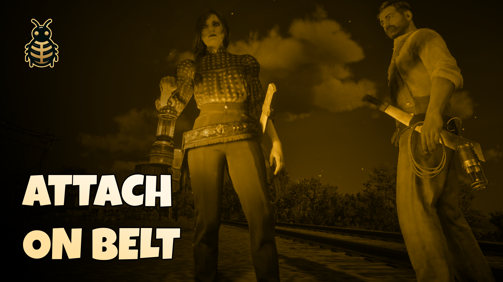
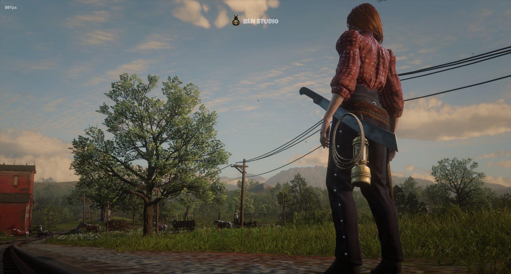
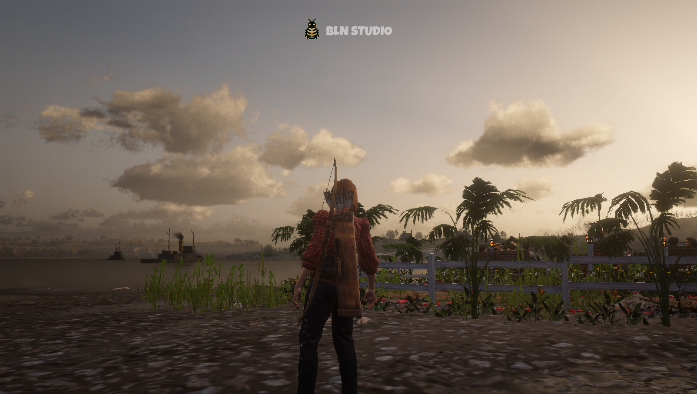

# RedM Belt Attachments


<div style="display: flex; justify-content: space-between;">
    
    
</div>

Realistically display your weapons and items on your character's belt when equipped from inventory but not in use! Works with lanterns, lassos, machetes, and more.

## Features
- Automatically shows/hides items on your belt
- Synchronized across all players - everyone sees each other's belt items
- Smooth transitions when equipping/unequipping
- Works with both male & female characters
- Supports multiple item types:
  - Regular and Davy lanterns
  - Regular and reinforced lassos
  - Machetes
  - Metal detector
  - Quiver
  - And more can be easily added!

There are 7 attachements already configured for you.

## Preview
[Video Preview](https://youtu.be/6ZGfaL8W5Ng)

## Installation
1. Download the `bln_belt_attachments` script
2. Place it in your server's `resources` folder
3. Add `ensure bln_belt_attachments` to your `server.cfg`

## 🛠️ Usage
The script works automatically once installed. When you have supported items in your inventory:
- Items appear on your belt when equipped but not in active use
- Automatically hide/show items when using them
- All players can see each other's belt attachments

### Supported Items
- `WEAPON_MELEE_LANTERN` - Regular lantern
- `WEAPON_MELEE_DAVY_LANTERN` - Davy lantern
- `WEAPON_KIT_METAL_DETECTOR` - Metal detector
- `WEAPON_LASSO` - Regular lasso
- `WEAPON_LASSO_REINFORCED` - Reinforced lasso
- `WEAPON_MELEE_MACHETE` - Machete
- `WEAPON_BOW` - Quiver

you can support/add more items as you need!

## How to Add New Categories and Attachments

### Adding a New Category

To add a new category of items (e.g., if you want to add a new type of weapon or tool), follow these steps:

1. Open `config.lua`
2. Add a new category to the `Config.categories` table
3. Add your items to the new category

Example of adding a new "knives" category:

```lua
Config.categories = {
    -- Existing categories here...
    
    knives = {  -- New category
        {
            hashName = 'WEAPON_MELEE_KNIFE',  -- Weapon hash name
            model = `w_melee_knife02`,        -- Model hash
            bone = {
                male = 'SKEL_R_Thigh',        -- Attachment bone for male
                female = 'skel_r_thigh',      -- Attachment bone for female
            },
            offset = {
                male = {
                    x = 0.0,
                    y = 0.0,
                    z = -0.11,
                    pitch = -83.0,
                    roll = 0.0,
                    yaw = 80.0,
                },
                female = false,  -- Use male settings for female
            },
        }
    }
}
```

### Adding New Items to Existing Categories

To add a new item to an existing category (e.g., adding a new type of lantern):

1. Identify the category you want to add to
2. Add a new item table to that category's array
3. Configure the item's properties

Example of adding a new lantern to the existing "lanterns" category:

```lua
Config.categories = {
    lanterns = {
        -- Existing lanterns...
        
        {   -- New lantern
            hashName = 'WEAPON_MELEE_LANTERN_HALLOWEEN',
            model = `s_interact_lantern_halloween`,
            bone = {
                male = 'PH_Lantern',
                female = 'PH_Lantern',
            },
            offset = {
                male = {
                    x = -0.05,
                    y = 0.0,
                    z = 0.0,
                    pitch = 0.0,
                    roll = 0.0,
                    yaw = 0.0,
                },
                female = false,
            },
        }
    }
}
```

### Configuration Properties Explained

When adding new items, you'll need to configure these properties:

- `hashName`: Can be either:
  - A string: Single weapon/item hash name (e.g., `'WEAPON_MELEE_LANTERN'`)
  - An array: Multiple weapon hashes (e.g., `{'weapon_bow', 'weapon_bow_improved'}`)
- `alwaysAttached`: Optional boolean
  - If `true`: Item stays attached when equipped, even while in use
  - If `false` or not set: Item only shows when equipped but not in active use
- `model`: The model hash for the attached item
- `bone`: Specifies attachment points
  - `male`: The bone name for male characters
  - `female`: The bone name for female characters (or `false` to use male settings)
- `offset`: Position and rotation settings
  - `male`: Offset values for male characters
    - `x`, `y`, `z`: Position offset from the attachment bone
    - `pitch`, `roll`, `yaw`: Rotation angles in degrees
  - `female`: Offset values for female characters (or `false` to use male settings)

### Bone Names

Here are some useful bone names for attachments:
[Bone Names](https://github.com/femga/rdr3_discoveries/tree/master/boneNames)

### Tips for Testing New Attachments

1. Start with offset values at 0.0 and adjust gradually
2. Test with both male and female characters
3. Check different animations to ensure the attachment looks good in motion
4. Use small increments (0.01-0.05) when adjusting position values
5. For rotation, use increments of 5-10 degrees initially

### Troubleshooting

If your attachment isn't appearing:
1. Verify the `hashName` matches exactly
2. Ensure the model exists and is loaded
3. Check if the bone name is correct
4. Try adjusting the offset values
5. Verify the item is properly registered in your inventory system

## Support 💬
Need help? Join our Discord server:
[Join Discord](https://discord.com/invite/MEZRYQVpnt)

## Credits 🙏
Created by [BLN Studio](https://bln.tebex.io)
Feel free to contribute to this project! 

## ⚠️ Note
This script is purely cosmetic and does not affect gameplay mechanics. It's designed to enhance immersion by displaying your items realistically when not in use.

