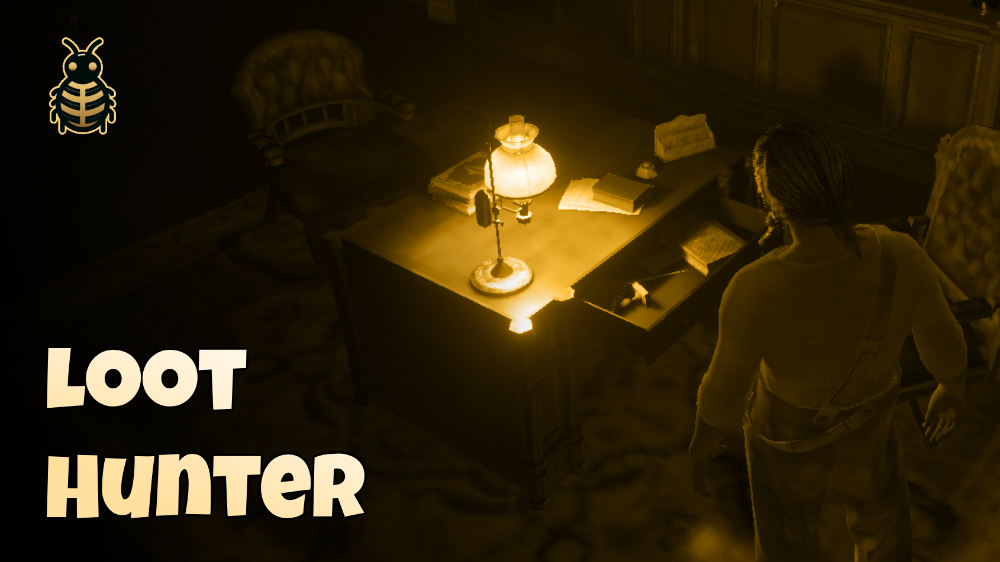

# 🔍 BLN Loot Hunter



## 📋 Overview

A comprehensive looting system for RedM, allowing players to search containers, loot bodies, and skin animals with a chance-based reward system. Fully compatible with all major RedM frameworks including VORP, RedEM, RedEM2023, QBR, RSG, and QR.

### 🎬 Preview
[**Video Preview**](https://youtu.be/GITDMO3yD9k)

## ✨ Features

- 🧰 **Loot Containers** - Search chests, drawers, cabinets, and more
- 💀 **Loot Bodies** - Search dead NPCs for valuable items
- 🦌 **Skin Animals** - Harvest materials from hunted animals
- 🎲 **Chance-based Rewards** - Configurable chances for different items
- 💲 **Money Rewards** - Find cash in containers and on bodies
- 📱 **Clean Notifications** - Visual feedback with item icons
- 🔄 **Location-based Cooldowns** - Prevents exploit farming
- 🛡️ **Server-side Validation** - Secure design to prevent cheating
- 🧩 **Multi-framework Support** - Works with all major RedM frameworks

## 💻 Framework compatibility
**✅ VORP ✅ REDEMRP(old/2023) ✅ RSG ✅QBR**.

## ⚙️ Dependencies
- [BLN Lib](https://bln-studio.com/package/6520120)

## 📥 Installation

1. Download the resource
2. Extract to your resources folder
3. Add `ensure bln_loot_hunter` to your server.cfg
4. Configure to your liking
5. Restart your server

## ⚙️ Configuration

The looting system is highly configurable through the `config.lua` file:

### Core Settings
```lua
Config = {}

Config.Debug = false  -- Enable for debugging information

Config.Cooldown = 600000  -- Global cooldown for containers and peds (10 minutes)

Config.inventoryURL = "nui://vorp_inventory/html/img/items/"  -- Path to inventory icons
```

### Container Configuration

Define which containers can be looted and what rewards they might contain:

```lua
Config.Containers = {
    [`p_chest02x`] = {
        label = "Chest",
        rewards = {
            money = {
                enabled = true,
                min = 5.0,
                max = 25.0,
                chance = 60  -- 60% chance
            },
            items = {
                enabled = true,
                list = {
                    { name = "goldbar",     min = 1,  max = 3,  chance = 60 },
                    { name = "goldwatch",   min = 1,  max = 2,  chance = 50 },
                    { name = "diamond",     min = 1,  max = 1,  chance = 60 },
                    { name = "pistol_ammo", min = 10, max = 20, chance = 70 }
                }
            }
        }
    },
    -- Add more containers as needed
}
```

### Ped Loot Configuration

Configure what items can be found when looting dead NPCs:

```lua
Config.Peds = {
    blacklist = {
        [`A_M_M_SDUpperClass_01`] = true,  -- Blacklisted peds that can't be looted
        [`A_F_M_ARMTOWNFOLK_01`] = true
    },
    rewards = {
        money = {
            enabled = true,
            min = 0.25,
            max = 3.0,
            chance = 40
        },
        items = {
            enabled = true,
            list = {
                { name = "medicine_poor", min = 1, max = 1, chance = 20 },
                { name = "cigarettepack", min = 1, max = 2, chance = 35 },
                { name = "whiskey",       min = 1, max = 1, chance = 15 },
                { name = "bread",         min = 1, max = 1, chance = 25 },
                { name = "pistol_ammo",   min = 2, max = 5, chance = 10 }
            }
        }
    }
}
```

### Animal Skinning Configuration

Define what materials can be harvested from different animal types:

```lua
Config.Animals = {
    [`a_c_hawk_01`] = {
        label = "Hawk",
        rewards = {
            items = {
                enabled = true,
                list = {
                    { name = "hawkf",                        min = 3, max = 6 },
                    { name = "provision_trinket_hawk_talon", min = 1, max = 1 }
                }
            }
        }
    },
    -- Add more animals as needed
}
```

### Notification Settings

Customize the feedback messages shown to players:

```lua
Config.Notifications = {
    -- Empty message (when nothing is found)
    Empty = {
        enabled = true,
        messages = {
            { title = "Empty",        message = "Nothing useful found",              type = "ERROR" },
            { title = "No Loot",      message = "This container is empty",           type = "ERROR" },
            { title = "Nothing Here", message = "You didn't find anything of value", type = "ERROR" }
        }
    },
    -- Cooldown messages
    Cooldown = {
        enabled = true,
        messages = {
            { title = "Already Searched", message = "This has been searched recently",      type = "ERROR" },
            { title = "Nothing Left",     message = "There's nothing more to find here",    type = "ERROR" },
            { title = "Empty Container",  message = "Someone has already taken everything", type = "ERROR" }
        }
    }
}
```

## 💡 How It Works

1. **Container Interaction:**
   - When a player opens a container in the world, the system detects this action
   - If the container is in the configuration, a loot check is triggered
   - Based on chance settings, rewards are generated and given to the player
   - Location-based cooldown prevents the same container from being looted again immediately

2. **Ped Looting:**
   - When a player loots a dead NPC, the system checks if it's a valid, non-blacklisted ped
   - Rewards are rolled based on configured chances
   - The corpse gets a cooldown to prevent multiple players from looting it

3. **Animal Skinning:**
   - When a player skins an animal, specific animal-type rewards are generated
   - Animals always provide materials based on their type and configuration

4. **Reward Notification:**
   - Players receive visual feedback showing exactly what they found
   - Money and items are displayed with appropriate icons
   - Clean, unobtrusive UI keeps the immersion intact

## 📚 Examples

### Adding a New Container Type

```lua
-- Add a new container type to the configuration
Config.Containers[`p_chest_fancy_01x`] = {
    label = "Fancy Chest",
    rewards = {
        money = {
            enabled = true,
            min = 10.0,
            max = 50.0,
            chance = 75
        },
        items = {
            enabled = true,
            list = {
                { name = "goldbar",    min = 2, max = 4, chance = 40 },
                { name = "goldwatch",  min = 1, max = 3, chance = 60 },
                { name = "diamond",    min = 1, max = 2, chance = 25 },
                { name = "goldnugget", min = 5, max = 10, chance = 80 }
            }
        }
    }
}
```

### Adding a New Animal Type

```lua
-- Add a new animal type to the configuration
Config.Animals[`a_c_wolf`] = {
    label = "Wolf",
    rewards = {
        items = {
            enabled = true,
            list = {
                { name = "wolfmeat",    min = 2, max = 4, chance = 100 },
                { name = "wolfpelt",    min = 1, max = 1, chance = 100 },
                { name = "wolftooth",   min = 1, max = 3, chance = 80 },
                { name = "wolfheart",   min = 1, max = 1, chance = 30 }
            }
        }
    }
}
```

## 🌟 Performance Optimizations

This looting system was built with performance in mind:
- Efficient event handling to minimize resource usage
- Location-based cooldowns to reduce unnecessary server calls
- Single notification system to prevent UI clutter
- Native RedM event integration for seamless gameplay

## 💬 Support

Need help? Have questions? Join our Discord server for support and updates!
- 💬 Discord: [Join Here](https://discord.bln-studio.com)
- 🎮 Live support and community help
- 🔄 Regular updates and improvements