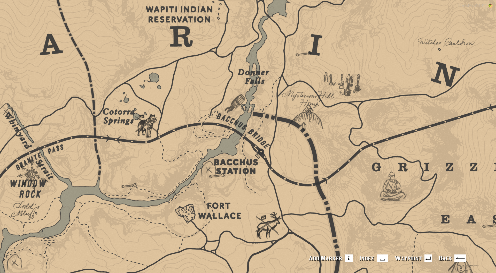

# BLN Map Discoveries

## Description
is a resource for RedM servers that  enables map discoveries as in Story Mode of RDR2. This enhances the gameplay experience by revealing all map locations without requiring manual intervention.



## Features

- Automatically enables all map discoveries on resource start.
- Automatically disables all map discoveries on resource stop.
- Includes a comprehensive list of all discoverable locations in Red Dead Redemption 2 story mode.

## Installation

1. Download the `bln_map_discoveries` folder.
2. Place the folder in your RedM server's `resources` directory.
3. Add the following line to your `server.cfg` file:
   ```
   ensure bln_map_discoveries
   ```

## Usage

Once installed and added to your `server.cfg`, the resource will automatically run when your server starts. No additional configuration or commands are necessary.

- When the resource starts, all map discoveries will be enabled.
- When the resource stops or the server shuts down, all map discoveries will be disabled.

## Technical Details

The resource uses the following native functions:

- `MapDiscoverRegion(hash)`: Enables a discovery
- `MapDiscoverySetEnabled(hash, false)`: Disables a discovery

## Customization

If you want to modify which discoveries are managed by this resource:

1. Open the `c/data.lua` file.
2. Modify the `DiscoveryData` table by adding or removing entries.
3. Each entry should follow this format:
   ```lua
   {hashname = "MAP_LOCATION_NAME", hash = 0xHASH_VALUE},
   ```

## Contributing

Contributions to improve the resource are welcome. Please feel free to submit pull requests or create issues for bugs and feature requests.

## Support

If you encounter any issues or have questions, please open an issue on the GitHub repository or contact the maintainer.
