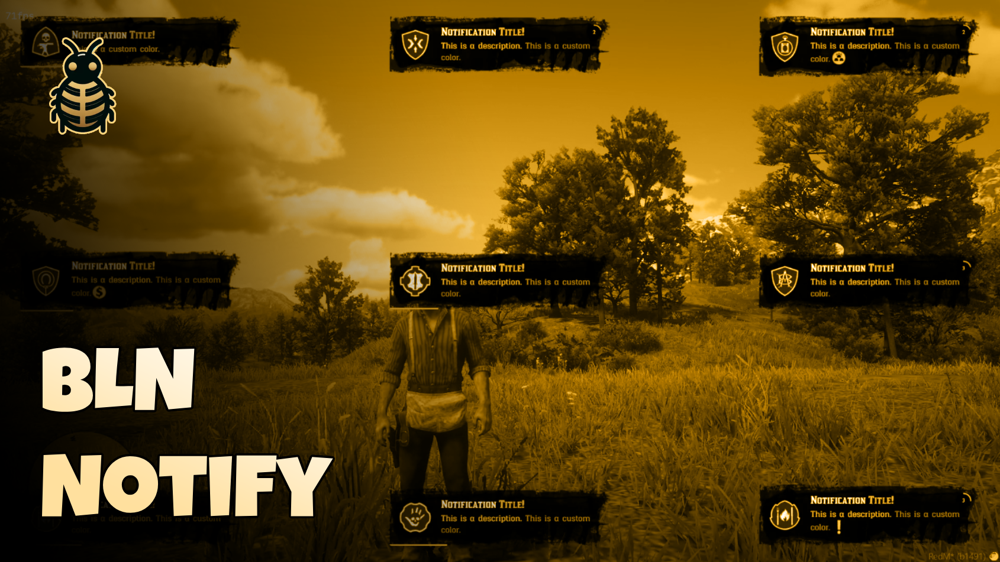

# BLN Notify


<div style="display: flex; justify-content: space-between;">
    
    
    
</div>
<div style="display: flex; justify-content: space-between;">
    
    
</div>

A standalone, flexible, and customizable notification system for RedM servers.

[Video Preview](https://youtu.be/kRLAsFJ-nSk)

## ✨ Features

- 🌐 RTL (Right-to-Left) support for multilingual notifications
- 📚 Predefined templates for easily reusable notifications
- 🧭 Support for all directions (9 placement options)
- 📱 Responsive design for various screen sizes
- 🎵 Customizable notification sounds
- 🎛️ Support for both advanced and simple notifications
- 🌈 Dynamic text coloring with inline color codes
- 🖼️ Inline images in text using `~img:name~` syntax
- ⌨️ Interactive key bindings with visual indicators
- 📊 Progress indicators (bar and circle types)
- 🎭 Flexible icon support (URL or local img name)
- ⏱️ Customizable duration for each notification
- 🔀 Adjustable content alignment (start, center, end)
- 🎬 Animated entrance and exit effects
- 🖥️ Both client-side and server-side triggering options
- 🛠️ Easy to integrate with existing resources
- 🎮 Designed specifically for RedM servers (Standalone)

## Documentation

### Client-Side Usage

To send a notification from the client-side:

```lua
TriggerEvent("bln_notify:send", options)
-- OR with template
TriggerEvent("bln_notify:send", options, template)
```

#### Basic Example
```lua
TriggerEvent("bln_notify:send", {
    title = "~#ffcc00~Hello!~e~",
    description = "This is a ~red~basic~e~ notification with ~img:info~ icon.",
    icon = "generic_list",
    placement = "middle-right"
})

-- With Template
TriggerEvent("bln_notify:send", {
    description = "This is a success template notification.",
    placement = "middle-right"
}, "SUCCESS")
```

#### Advanced Example with Progress and Key Actions
```lua
TriggerEvent("bln_notify:send", {
    title = "~#ffcc00~Advanced Example~e~",
    description = "Press ~key:E~ to accept or ~key:F6~ to decline",
    icon = "warning",
    placement = "middle-left",
    duration = 10000,
    progress = {
        enabled = true,
        type = 'circle', -- or 'bar'
        color = '#ffcc00'
    },
    keyActions = {
        ['E'] = "accept", -- action name used when listen
        ['F6'] = "decline"
    }
})
```

### Server-Side Usage

To send a notification from the server-side:

```lua
-- Send to specific player
TriggerClientEvent("bln_notify:send", source, options)
-- OR with template
TriggerClientEvent("bln_notify:send", source, options, template)


-- Send to all players
TriggerClientEvent("bln_notify:send", -1, options)
-- OR with template
TriggerClientEvent("bln_notify:send", -1, options, template)
```

The notification options are exactly the same as in client-side examples. The only difference is that on the server-side you need to:
1. Use `TriggerClientEvent` instead of `TriggerEvent` to target a client.
2. Provide the `source` (player id) as the second parameter
3. Use `-1` as the source to send to all players

#### Example
```lua
-- Server-side
TriggerClientEvent("bln_notify:send", source, {
    title = "Hello!",
    description = "This is a notification",
    placement = "middle-right"
})

-- To all players
TriggerClientEvent("bln_notify:send", -1, {
    title = "Server Announcement",
    description = "This goes to everyone",
    placement = "top-right"
}, "INFO")
```


### Notification Options

| Option | Description | Default | Required/Optional |
|--------|-------------|---------|-------------------|
| placement | Position of the notification | "top-right" | Optional |
| title | Title of the notification | "Notification" | Required |
| description | Description text for the notification | null | Optional |
| duration | Time in milliseconds before auto-removal | 5000 | Optional |
| icon | [Icon name]('https://github.com/blnStudio/bln_notify/tree/main/ui/assets/imgs/icons') or URL | null | Optional |
| useBackground | Whether to use background image | true | Optional |
| contentAlignment | Content alignment | "start" | Optional |
| isRTL | Right-to-left text direction | false | Optional |
| progress | Progress indicator options | null | Optional |
| keyActions | Key binding actions | null | Optional |
| customSound | Custom notification sound | Default sounds | Optional |

### Key Actions & Event Handling

Key actions allow you to add interactive key bindings to your notifications. When a specified key is pressed, it triggers an event that you can listen to in your scripts.

#### Basic Usage Example
```lua
-- Send notification with key actions
TriggerEvent("bln_notify:send", {
    title = "Interaction Available",
    description = "Press ~key:E~ to interact or ~key:F6~ to cancel",
    duration = 10000,
    keyActions = {
     -- ['key_name'] = 'action_name'
        ['E'] = "accept",      -- 'accept' is the action name that will be triggered
        ['F6'] = "decline"      -- 'decline' is the action name
    }
})

-- Listen for key press events in your script
RegisterNetEvent("bln_notify:keyPressed")
AddEventHandler("bln_notify:keyPressed", function(action)
    if action == "accept" then
        print("accept key was pressed!")
        -- Do your accept logic here
    elseif action == "decline" then
        print("decline key was pressed!")
        -- Do your decline logic here
    end
end)
```
- `key_name`: The key names are specific to RedM's key mapping system. Make sure to use the correct key names in your `keyActions` configuration, list of allowed keys can be found at `client/keys.lua`.
- `action_name`
- Key icons: to show key icon in a notification description, use as `~key:name~`. The `name` can be anything like `E`, `ENTER`, `<-` ..etc. Its only a text in view, so it does not affect the key actions above if we put anything.


### Progress Options
```lua
progress = {
    enabled = true, -- Enable/disable progress indicator
    type = 'bar', -- 'bar' or 'circle with countdown'
    color = '#ffcc00' -- Custom color for progress
}
```

### Text Formatting
Can add color anywhere in your text (title or description).
#### Color Formatting
- Named colors: `~red~colored text~e~`
- Hex colors: `~#ffcc00~colored text~e~`

#### Image Formatting
You can add inline images/icons to notification's description as follows:
- [Icon name]('https://github.com/blnStudio/bln_notify/tree/main/ui/assets/imgs/icons') or URL, e.g. `~img:icon_name~` or `~img:full_url~`,


### Templates

Predefined templates available in `Config.Templates`:
- `INFO`: Information notifications with blue styling
- `SUCCESS`: Success messages with green styling
- `ERROR`: Error messages with red styling
- `REWARD_MONEY`: Reward notifications with gold styling
- `TIP`: Simple tip notifications
- `TIP_XP`, `TIP_GOLD`, `TIP_CASH`: Specialized tip notifications

### Demo Commands

Test commands available in game:
- `/bln_notify_allAdvanced [RTL]`: Show all placement demos
- `/bln_notify_allTips [RTL] [icon]`: Show all tip types
- `/bln_notify_progress [type]`: Show progress notification
- `/bln_notify_key`: Show key binding notification
- `/bln_notify_template [template] [title] [desc]`: Test templates
- `/bln_notify [RTL] [title] [desc] [icon] [placement]`: Custom notification


## Support

For help and support, join our [Discord](https://discord.com/invite/MEZRYQVpnt) or create an issue on GitHub.

## Contributing

Contributions are welcome! Feel free to submit pull requests or create issues for bugs and features.
